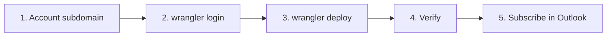

# Runbook: deploy transit-ics to Cloudflare Workers

How the Worker was first set up (2026-10-08), and how to update, roll back and troubleshoot it. Every command runs in PowerShell from the repo root. Dashboard steps were captured by driving the Cloudflare dashboard with Playwright, so screen and button names match the October 2026 UI.

Feed URL template: `https://transit-ics.<subdomain>.workers.dev/transit.ics`. The real subdomain is deliberately not in this repo; see [Keep the hostname out of git](#keep-the-hostname-out-of-git).



## Prerequisites

- A Cloudflare account on the Workers **Free** plan. Nothing in this project needs a paid plan or a credit card.
- Node.js 22 or later, and `npm install` run in the repo. `wrangler` is a local dev dependency, so always call it as `npx wrangler`. Never install it globally.
- Optional: `$env:WRANGLER_SEND_METRICS = "false"` to opt out of wrangler's usage telemetry.

## 1. Set a random `workers.dev` subdomain (one-time)

Every Worker on the account is served at `<worker-name>.<subdomain>.workers.dev`. New accounts get a subdomain derived from the sign-up email, which would put your email in a URL you share with family, and anyone can guess a name. Change it to a random string first.

1. Generate one (10 characters, about 50 bits):

   ```powershell
   node -e "const a='abcdefghijkmnpqrstuvwxyz23456789'; console.log([...require('crypto').randomBytes(10)].map((b) => a[b % 32]).join(''))"
   ```

   If Cloudflare rejects it or it's taken, generate a new one; don't edit it by hand.
2. Dashboard: **Compute → Workers & Pages**. Check the list shows only Workers you expect to move: the setting is account-wide. In the right-hand **Account details** panel, find **Subdomain** and click **Edit**.
3. **Choose your new subdomain:** paste it and click **Continue**. The page confirms whether it is available.
4. **Confirm update:** read the warning and click **Update**.
   - Hostnames on the old subdomain stop working **immediately**. On 2026-10-08 they failed at the TLS handshake (no HTTP response, no redirect).
   - The new hostname can take a minute or so to start answering. On 2026-10-08 the first requests failed for about 40 seconds.
5. Save the full URL in your password manager. Never commit it.

Changing the subdomain again later breaks every subscriber's URL.

## 2. Sign in wrangler (one-time per machine)

```powershell
npx wrangler login
```

This opens Cloudflare's **"Wrangler wants to access your account"** consent page (owned by Cloudflare). Check that the account shown is the right one and click **Authorize**. The browser then lands on "Wrangler Authorization Granted" and the terminal prints `Successfully logged in.`

- This is an **OAuth token with broad scope** (about 28 permissions across Workers, KV, D1, Pages and more), not a scoped API token. You can narrow it with **Edit Permissions** on the consent page.
- It is stored at `%APPDATA%\xdg.config\.wrangler\config\default.toml`. Check with `npx wrangler whoami`.
- To revoke it: `npx wrangler logout`, or in the dashboard **My Profile → Access Management → Connected Applications**.
- No API token or GitHub secret is involved. See [Optional: auto-deploy](#optional-auto-deploy) before creating one.

On a machine without a browser, run `npx wrangler login --browser=false` and open the printed link yourself. The redirect goes to `localhost:8976`, so the browser must be on the same machine.

## 3. Deploy

```powershell
npm test && npx wrangler deploy
```

`&&` runs the deploy only if the tests pass. It needs PowerShell 7+. In Windows PowerShell 5.1 the line is a parse error and nothing runs, so it fails safe.

Expected output:

```text
Uploaded transit-ics (0.82 sec)
Deployed transit-ics triggers (0.40 sec)
  https://transit-ics.<subdomain>.workers.dev
Current Version ID: <uuid>
```

The Worker name (`transit-ics`), entry point, `compatibility_date` and `preview_urls = false` come from `wrangler.toml`. The upload is about 5 KiB with a 2 ms startup time.

## 4. Verify

```powershell
$u = "https://transit-ics.<subdomain>.workers.dev"   # your real URL, from your password manager
curl.exe -s -D - -o NUL "$u/transit.ics"                # 200, text/calendar; charset=utf-8
curl.exe -s "$u/transit.ics" | Select-String "^SUMMARY"  # one line per current 2 Line alert
curl.exe -s -o NUL -w "%{http_code}`n" "$u/transit.ics?routes=2LINE%0D%0AX"  # 400
curl.exe -s -o NUL -w "%{http_code}`n" "$u/"                                 # 404
```

Compare the `SUMMARY` lines with the 2 Line alerts on [soundtransit.org](https://www.soundtransit.org/ride-with-us/service-alerts). On 2026-10-08 both showed the same four alerts.

## 5. Subscribe

Follow [Subscribe in Outlook.com](../README.md#subscribe-in-outlookcom) in the README with your real URL. Add `?routes=2LINE,100479` for the 1 Line as well.

## Updating

Merge to `main` with CI green, then from an up-to-date `main`:

```powershell
git switch main && git pull --ff-only && npm ci && npm test && npx wrangler deploy
```

Any failure stops the chain: uncommitted changes blocking the switch, a pull that isn't a fast-forward, or a failing test.

Subscribers need no action. The URL doesn't change, and calendar clients pick up the new output on their next refresh.

## Rolling back

```powershell
npx wrangler deployments list                         # find the previous version id
npx wrangler rollback <version-id> -m "reason"
```

Rollback switches traffic to an earlier uploaded version immediately. It does not change the repo, so fix or revert in git afterwards.

## Troubleshooting

| Symptom | Likely cause | What to do |
|---|---|---|
| `curl: (6) Could not resolve host` right after setup | New subdomain still propagating | Wait a few minutes |
| 502 `Upstream feed error` | Sound Transit's S3 feed is failing | Nothing. By design ([ADR 4](adr/0004-upstream-failure-returns-502.md)), Outlook keeps its last good copy |
| Error 1027 | Daily free-plan request limit reached | Wait for the reset at midnight UTC. If it recurs, the hostname has probably leaked; see below |
| 500 / error 1101 | Worker threw, e.g. the feed's JSON shape changed | `npx wrangler tail transit-ics`, then request the URL to see the exception |
| 400 `Invalid routes` | `?routes=` has an id that isn't 1–32 letters, digits or `_`, or more than 10 ids | Fix the subscription URL |
| Calendar lags the website | Outlook's refresh cadence (hours) | Expected; keep email/SMS alerts for same-day changes |
| `wrangler dev` fails on Windows ARM64 | `workerd` has no Windows-ARM64 build | Use WSL, or skip local dev. `wrangler deploy` does not need `workerd` |

## Keep the hostname out of git

The Worker name is public (`wrangler.toml`), so the account subdomain is the only unguessable part of the feed URL. The Workers Free plan allows 100,000 requests a day. After that, requests get error 1027 until the reset at midnight UTC. Every request that reaches the Worker counts, including ones it answers with 400 or 404. So anyone who knows the hostname can take the calendar offline for the rest of the day. It costs nothing (the free plan can't bill), and Outlook keeps showing its last copy.

- **Never commit or publish the real hostname in GitHub content:** files, commit messages, PRs or issues. Use the `<subdomain>` placeholder. `test/no-leaks.test.js` fails CI if a concrete `*.workers.dev` hostname appears in any file.
- **Who does see it:** Cloudflare, Outlook and the people you share the calendar with, plus DNS and your local browser and shell history. Keep the full URL in your password manager.
- **Preview URLs are off** (`preview_urls = false` in `wrangler.toml`). Otherwise each uploaded version could also get its own public hostname on the same subdomain, drawing on the same quota.
- **This is obscurity, not access control.** It stops the hostname leaking through this public repo. It doesn't stop someone who discovers it another way (for example DNS or certificate logs, which haven't been checked). Real rate limiting would need a custom domain on Cloudflare.
- **If it leaks:** generate a new random subdomain (section 1), update subscribers, and treat the old one as burned. Don't switch back to an old subdomain.

## Optional: auto-deploy

Not set up. Deploys are manual on purpose. If that changes, record the choice in a new ADR. The two options:

- **Cloudflare Workers Builds** (connect the GitHub repo in the dashboard). Uses Cloudflare build minutes, not GitHub Actions minutes, and needs no secret in GitHub.
- **GitHub Actions job** with a `CLOUDFLARE_API_TOKEN` secret, scoped to *Workers Scripts: Edit* on this account only. Costs Actions minutes while the repo is private.
